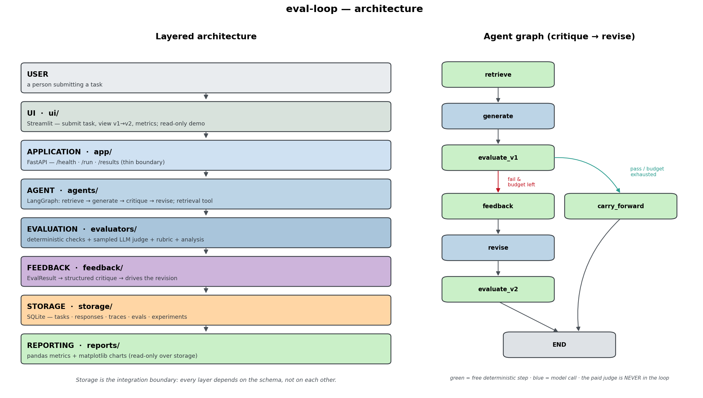

# Architecture — `eval-loop`

A self-improving agent with an evaluation-driven feedback loop. Given a task, the
agent retrieves grounding context, generates an answer, scores it, critiques
itself, revises, and re-scores — while an evaluation framework measures quality
across a fixed dataset and tracks **measurable improvement** across experiments.

> **What "self-improving" means here:** the agent improves its *output* within a
> task (a critique→revise loop) and, across experiments, we track and can tune
> its *prompts*. **Model weights are frozen** — this is program/response
> optimization, not retraining. It is **offline evaluation on synthetic + golden
> traffic**, not live production monitoring.



---

## 1. Design principles

1. **Storage is the integration boundary.** Every layer depends on the data
   *schema* ([`storage/models.py`](../storage/models.py)), not on other layers
   directly. SQLite ([`storage/db.py`](../storage/db.py)) is the *only* module
   that touches the database. This makes the system reproducible and lets
   evaluation and reporting run **offline** on stored data without re-running the
   agent.
2. **One choke point per side effect.** Every model call goes through
   [`agents/llm.py`](../agents/llm.py); every DB access through
   [`storage/db.py`](../storage/db.py). Swapping the model provider or the
   storage engine touches exactly one file.
3. **Three roles kept distinct.** The *doer* (agent), the *judge* (evaluator),
   and the *critic* (feedback) are separate modules so each can be reasoned about
   and tested in isolation.
4. **Cheapest-first evaluation.** Free deterministic checks run on the *full*
   dataset; the paid LLM judge runs only on a reproducibly sampled subset, and
   **never inside the loop**.
5. **Validated data at every boundary.** Pydantic v2 models cross every layer;
   no raw dicts are passed around.
6. **Config, not constants.** Nothing hardcodes a path, model name, or threshold;
   all of it lives in [`config/settings.py`](../config/settings.py).

---

## 2. Layered architecture

```
USER          a person submitting a task
  │
UI            ui/streamlit_app.py — submit task, view v1→v2, metrics, charts;
  │           read-only demo mode (zero live API calls)
APPLICATION   app/main.py — thin FastAPI: /health, /run, /results
  │
AGENT         agents/ — LangGraph graph: retrieve → generate → evaluate →
  │           (feedback → revise → evaluate | carry_forward); retrieval tool
EVALUATION    evaluators/ — deterministic checks + sampled LLM judge + rubric +
  │           runner + failure-mode analysis → structured scores
FEEDBACK      feedback/ — turns an EvalResult into structured critique and
  │           drives the revision
STORAGE       storage/ — SQLite: tasks, responses, traces, eval_results,
  │           experiments. The integration boundary.
REPORTING     reports/ — pandas metrics + matplotlib charts (read-only over storage)
```

Each layer’s single responsibility:

| Layer | Module(s) | Responsibility |
|---|---|---|
| Config | [`config/`](../config/) | Settings + logging; the only place values live |
| Agent | [`agents/`](../agents/) | The system under test — retrieve, generate, revise |
| Evaluation | [`evaluators/`](../evaluators/) | The measuring instrument — checks, judge, runner, analysis |
| Feedback | [`feedback/`](../feedback/) | Diagnose + propose improvement (the critic) |
| Datasets | [`datasets/`](../datasets/) | Fixed KB + golden + synthetic inputs (committed) |
| Storage | [`storage/`](../storage/) | The sole SQLite module + the schema everything shares |
| Reporting | [`reports/`](../reports/) | Metrics aggregation + charts (reads only from storage) |
| Application | [`app/`](../app/) | Thin FastAPI boundary so UI and agent are decoupled |
| UI | [`ui/`](../ui/) | Streamlit presentation; live + read-only demo modes |

---

## 3. The agent graph

[`agents/graph.py`](../agents/graph.py) compiles a LangGraph `StateGraph` over
[`AgentState`](../agents/state.py). Nodes and edges:

```
retrieve → generate → evaluate_v1 ─┬─(should_revise: fail & budget left)→ feedback → revise → evaluate_v2 → END
                                   └─(pass, or iteration ≥ max)──────────→ carry_forward ───────────────→ END
```

- **`retrieve`** — [`agents/tools.py`](../agents/tools.py) loads the markdown KB,
  splits each doc into `## section` chunks, and ranks them by stopword-filtered
  token overlap (pure, deterministic, embedding-free). Off-topic queries return
  *no* context, so the agent can honestly say it lacks grounding.
- **`generate`** — produces the v1 answer from the retrieved context only
  (grounding system prompt in [`agents/prompts.py`](../agents/prompts.py)).
- **`evaluate_v1`** — scores v1 with the **free deterministic suite only**; this
  decides whether to revise.
- **`should_revise`** — revises only when v1 failed *and* `iteration <
  max_iterations`; otherwise carries v1 forward. This guarantees termination and
  guarantees a v2 always exists (so the dataset delta is an honest value, never
  missing).
- **`feedback`** — [`feedback/generator.py`](../feedback/generator.py) maps low
  deterministic scores to concrete instructions, naming the *exact* missing key
  points. Deterministic and free; it uses `task.key_points` (a structural spec)
  but **never the golden `expected` answer** — so the improvement is real, not
  label leakage.
- **`revise`** — [`feedback/improve.py`](../feedback/improve.py) re-generates on
  the **default free provider**, applying the feedback while staying grounded in
  the same context.
- **`evaluate_v2`** / **`carry_forward`** — both emit a V2 response + its score.

Every node emits a [`Trace`](../storage/models.py) row, so any run can be
reconstructed and audited offline. **The paid judge is never called inside the
loop** (CLAUDE.md §2); it enters only at the dataset-comparison stage.

---

## 4. The evaluation framework

The heart of the project (CLAUDE.md §7). Quality is *graded*, not binary, so
without measurement there is no basis to claim improvement.

**Hybrid, cheapest-first:**

- **Deterministic checks** ([`evaluators/checks.py`](../evaluators/checks.py),
  free, full dataset): `non_empty`, `length`, `grounding` (response↔context token
  overlap), and `coverage` (required key-points present). Grounding returns 1.0
  and says "not applicable" when nothing was retrieved, so an honest "I don't
  know" isn't penalized.
- **LLM-as-judge** ([`evaluators/judge.py`](../evaluators/judge.py), Haiku,
  sampled, cached): subjective `correctness` / `completeness` / `clarity` scored
  against the rubric ([`evaluators/rubric.py`](../evaluators/rubric.py)). The
  system/rubric prompt is sent with `cache_control` (~90% cached-input savings),
  parsing degrades gracefully to a deterministic-only result, and the call
  never crashes a batch.

**Scoring** ([`evaluators/runner.py`](../evaluators/runner.py)): `overall_score`
is the deterministic mean, or a 50/50 blend of the deterministic mean and the
judge mean when judged. `select_judge_indices` picks the judged subset with a
seeded RNG, so the same dataset + seed always sample the same rows. For the loop,
the **same indices are judged for both v1 and v2** — a fair comparison.

**Failure-mode analysis** ([`evaluators/analysis.py`](../evaluators/analysis.py)):
clusters failing results by which criteria fell below threshold into named modes
(`low_grounding`, `missing_coverage`, …) so the next iteration targets the right
problem.

**Judge trust:** [`evaluators/validate_judge.py`](../evaluators/validate_judge.py)
ranks reference answers against degraded (off-topic/truncated) variants and
reports agreement with honest N before any judge score is trusted.

---

## 5. How improvement is measured

The eval set is **fixed**; only the agent/response changes. Improvement is
`mean(v2) − mean(v1)` over the dataset, plus a rising trend across experiments.
A **held-out `test` split** the feedback step never tunes against guards against
overfitting. N is reported honestly: at small N the trend is **directional**, not
production-grade significant.

---

## 6. Data flow & storage

- **Originates:** user task (UI/API) or dataset inputs
  ([`datasets/`](../datasets/), fixed and committed).
- **Validated:** at every boundary via the Pydantic models — `Task`,
  `AgentResponse`, `Trace`, `CriterionScore`, `EvalResult`, `Experiment`.
- **Stored:** SQLite — five tables, one row per task / response / trace / eval /
  experiment. Lists and dicts serialize to JSON text; timestamps to ISO-8601.
  Writes are idempotent (`INSERT OR REPLACE`).
- **Aggregated:** [`reports/metrics.py`](../reports/metrics.py) recomputes
  summaries, per-criterion means, version comparisons, the cross-experiment
  trend, and a regression gate — all pure over the stored models.
- **Visualized:** [`reports/charts.py`](../reports/charts.py) renders four PNGs
  (trend, v1-vs-v2, per-criterion, failure modes) with a headless matplotlib
  backend.

**Fixed vs produced:** KB docs, golden labels, and synthetic inputs are fixed
(authored/generated once, frozen, committed). Traces, scores, and experiment
records are produced fresh each run.

---

## 7. Cost design (CLAUDE.md §2)

- The high-volume agent runs **locally on Ollama (`qwen2.5:7b`) — free**.
- The paid Haiku model is used **only** as the sampled judge, with the rubric
  prompt cached.
- Deterministic checks (free) cover everything with a structural answer.
- The deployed Streamlit demo serves a **committed snapshot** (`demo_results.db`
  + precomputed charts) and makes **zero live API calls**.
- A `MODEL_PROVIDER` switch enables an all-Haiku mode for higher quality when
  desired; the default is cost-safe.

Estimated total spend at default settings: **≈ $0.50–1.50**. See
[`README.md`](../README.md#results) for the realized cost.

---

## 8. Key design decisions

| Decision | Why |
|---|---|
| Storage as the integration boundary | Reproducibility; offline re-scoring; layers swap independently |
| Embedding-free, deterministic retriever | Trustworthy eval needs reproducible retrieval; no model/index cost |
| One tokenizer shared by retriever + checks | "Grounding/coverage" measure exactly what retrieval saw — no drift |
| Judge never inside the loop | The loop must stay free; the judge is for *measuring*, not driving |
| Feedback uses `key_points`, not `expected` | Prevents golden-label leakage — the improvement is real |
| `carry_forward` always emits a v2 | The dataset delta is an honest 0, never a missing value |
| Responder/loop-runner injected into the runner | Decouples evaluation from the live graph; fully testable offline |

---

## 9. Reproducing the results

```bash
python main.py run "What is LLM-as-judge?"     # one task, full loop (local, free)
python main.py evals --dataset golden --loop --split test   # held-out improvement
python main.py report --gate                   # metrics + charts + regression gate
python main.py demo                            # rebuild the committed demo snapshot
```

All commands are offline and free except the opt-in sampled judge
(`validate-judge`, or `evals` without `--no-judge`), which calls Haiku.
